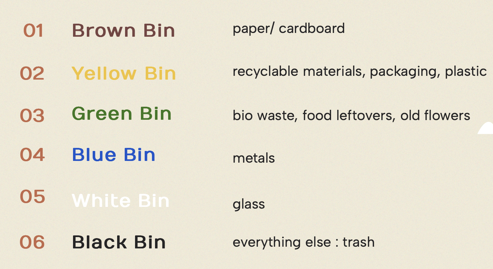
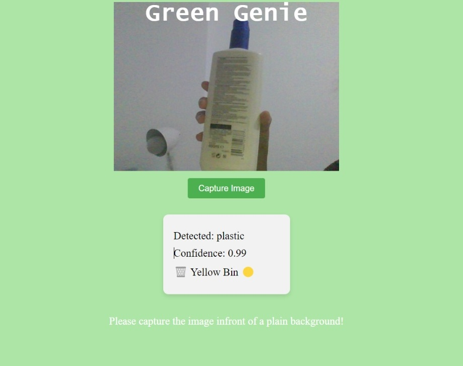
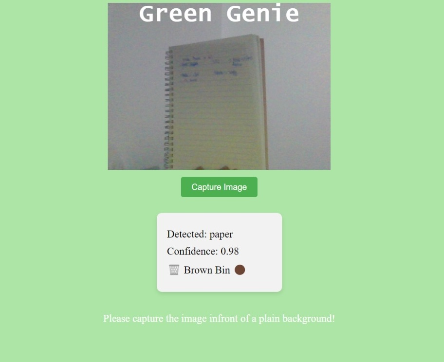
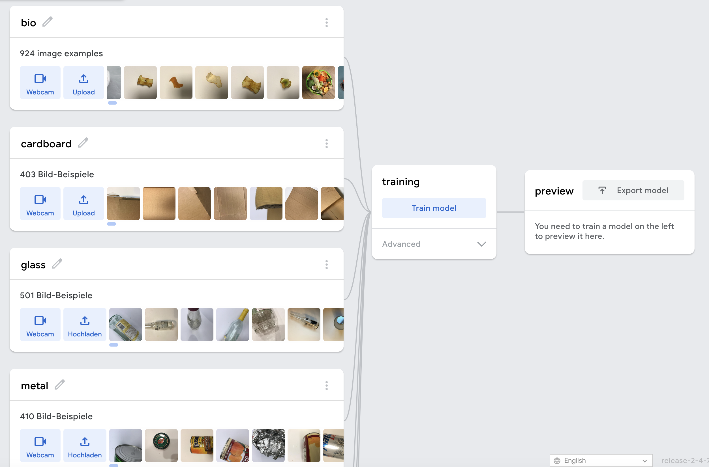

Hello, I am Zoya, a high school student from Abidjan, Ivory Coast.

# Green Genie

In 2021, 483 kgs of household waste was collected from Germany alone. Luckily, developed countries like Germany have a legally defined waste separation system. This means that different waste materials for example bio waste, recyclable plastic, glass, metal are supposed to be disposed off in designated bins. This has several advtanges including streamlined recylcing, reduced landfills as well as greenhouse gases. Although developing countries like Ivory Coast do not have such systems in-place, we can make individual efforts, starting from our household waste management. 

Green Genie is a web application that allows users to capture images from their webcam and figure out the best way to dispose off their waste objects. This project is a step forward towards attaining the SGD Goal 13: Climate Action. 

This application can be used by people who are new to waste management or are still confused about what bin certain items should go into. 

## Data Collection

The following datasets were used and slightly modified for training this web application: 

* [TrashNet](https://huggingface.co/datasets/garythung/trashnet)
* [Kaggle](https://www.kaggle.com/datasets/angelikasita/waste-images?resource=download) 

## Training the Model

For training the machine learning model, Google's Teachable Machine was used. The Teachable Machine uses [MobileNet](https://arxiv.org/abs/1704.04861) in the background. MobileNet is a type of convolutional neural network designed for mobile and embedded vision applications. When we train a model via the Teachable Machine, it is using a principle called [Transfer Learning](https://datascientest.com/en/transfer-learning-what-is-it). Transfer Learning is the ability to use knowledge that has already been learned to help learn a different but similar thing. Due to this, we are able to train a good model with a decent accuracy.

## Tech Stack

Once the ML was built and downloaded, ml5.js was used in combination with HTML/CSS to build the webpage. ml5.js is a library that allows users to play around with machine learning models within their browsers. In older days, we might have needed a high computational computer in order to run machine learning models. However, with ml5, we can just run models in our browser without having to worry about computing power. 

## Challenges Faced

This project required extensive research before and during the actual implementation. Understanding topics like Transfer Learning was a bit tricky as a first-timer but it was an interesting learning experience. 

Setting up ml5.js locally was also challenging initially since all the available tutorials were using old/incompatible versions.

## Future Developments 

* Improve training data
* Add more features for example picture uploading instead of webcam capturing
* Develop a mobile app so users can take better quality pictures and get better results from the ML model

## Usage Instructions

* Capture a picture of an item that you want to discard.
* Make sure you are in a well-lit environment.
* Make sure there are no other objects intereferring in the background.
* Then, GreenGenie will suggest you an appropriate bin. 

## Deployment

Deployed via Netlify here: https://greengenie.netlify.app